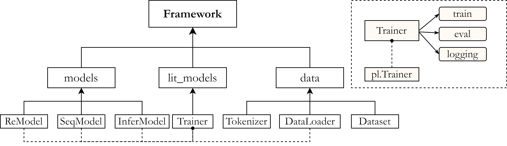

[**中文说明**](https://github.com/zjunlp/openue/blob/master/README_CN.md) | [**English**](https://github.com/zjunlp/openue/)
<p align="center">
    <a href="https://github.com/zjunlp/openue"> </a>
</p>

<p align="center">
<strong> OpenUE is a toolkit that provides a off-the-shelf framework to implement lots of NLP extraction tasks. 
    </strong>
</p>
    <p align="center">
    <a href="https://badge.fury.io/py/openue">
        
    </a>
    <a href="https://github.com/zjunlp/openue/blob/master/LICENSE">
        
    </a>
        <a href="http://openue.top">
        
    </a>
</p>

OpenUE 是一个简单可用的通用自然语言信息抽取工具，适用于python 初学者或有经验的机器学习开发人员。

**特点**


  - 基于SOTA模型的NLP抽取任务 (兼容BERT, XLNet等预训练模型.)
    - 实体关系抽取
    - 意图识别和槽位填充
    - 事件抽取
    - <em> 更多的任务 </em>
  - 训练和测试接口
  - 快速部署NLP模型

## 环境

  - python3.8
  - requirements.txt


## 框架图



其中主要分为三个模块，`models`,`lit_models`和`data`模块。

### models 模块

其存放了我们主要的三个模型，针对整句的关系识别模型，针对已知句中关系的命名实体识别模型，还有将前两者整合起来的推理验证模型。其主要源自`transformers`库中的已定义好的预训练模型。

### lit_models 模块

其中的代码主要继承自`pytorch_lightning.Trainer`。其可以自动构建单卡，多卡，GPU,TPU等不同硬件下的模型训练。我们在其中定义了`training_steps`和`validation_step`即可自动构建训练逻辑进行训练。

由于其硬件不敏感，所以我们可以使用多种不同环境下调用OpenUE训练模块。

### data 模块

`data`中存放了针对不同数据集进行不同操作的代码。使用了`transformers`库中的`tokenizer`先对数据进行分词处理再根据不同需要将数据变成我们需要的features。

## 快速开始

### 安装

#### Anaconda 环境

```
conda create -n openue python=3.8
conda activate openue
pip install -r requirements.txt
conda install pytorch torchvision torchaudio cudatoolkit=11.1 -c pytorch -c nvidia # 视自己Nvidia驱动环境选择对应的cudatoolkit版本
python setup.py install
```

#### 使用方式

数据格式为`json`文件，具体例子如下。

```json
{
	"text": "查尔斯·阿兰基斯（Charles Aránguiz），1989年4月17日出生于智利圣地亚哥，智利职业足球运动员，司职中场，效力于德国足球甲级联赛勒沃库森足球俱乐部",
	"spo_list": [{
		"predicate": "出生地",
		"object_type": "地点",
		"subject_type": "人物",
		"object": "圣地亚哥",
		"subject": "查尔斯·阿兰基斯"
	}, {
		"predicate": "出生日期",
		"object_type": "Date",
		"subject_type": "人物",
		"object": "1989年4月17日",
		"subject": "查尔斯·阿兰基斯"
	}]
}
```

将数据存放在`./dataset/`目录下之后进行训练。运行以下脚本，将自动下载数据集和预训练模型并开始训练，过程中请保持网络畅通以免模型和数据下载失败。

```shell
./scripts/run_ner.sh
./scripts/run_seq.sh
```

下面使用一个小demo简要展示训练过程，其中仅训练一个batch来加速展示。

### notebook快速开始

[ske数据集训练notebook](https://github.com/zjunlp/OpenUE/blob/pytorch/ske.ipynb)
使用中文数据集作为例子具体介绍了如何使用openue中的`lit_models`,`models`和`data`。方便用户构建自己的训练逻辑。


## 引用

如果您使用或扩展我们的工作，请引用以下文章：

```
@inproceedings{zhang-2020-opennue,
    title = "{O}pe{UE}: An Open Toolkit of Universal Extraction from Text",
    author = "Ningyu Zhang, Shumin Deng, Zhen Bi, Haiyang Yu, Jiacheng Yang, Mosha Chen, Fei Huang, Wei Zhang, Huajun Chen",
    year = "2020",
}
```
